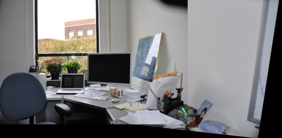
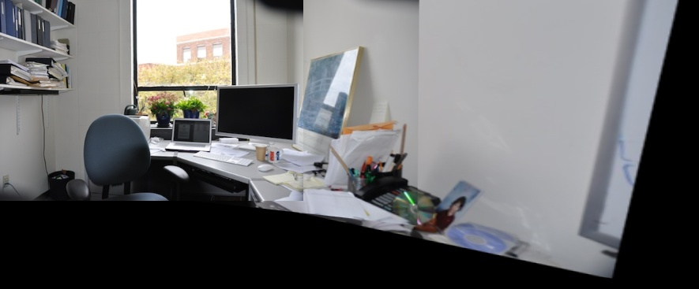

# ImageMosaicing
Apply a Harris corner detector to find corners in two images, automatically find corresponding features, estimate a homography between the two images, and warp one image into the coordinate system of the second one to produce a mosaic containing the union of all pixels in the two images.

## Usage
Clone the repository and run the following command in the root directory:
```
mkdir build && cd build && cmake .. && make
```

Place the two images you want to mosaic in respective folders named `DanaHallway1` and `DanaOffice` in the `build` directory.

Run the binary with the following command:
```
./ImageMosaicing <path to input image 1> <path to input image 2>
```

## Description of Files
* `CMakeLists.txt`: CMake file to build the project
* `src/main.cpp`: Main file that runs the program
* `inc/cv_factory.hpp`: Factory class to create cvf class and functionalities to do corner detection, feature matching, homography estimation, and image warping

## Methodology
### Reading Images
* The images are read using the OpenCV imread function.
* The images are converted to grayscale and resized to 50% of their original size.
### Harris Corner Detector
* Compute the Harris corner detector response for each pixel in the image. The Harris corner detector response is computed as the determinant of the matrix M minus the trace squared, where M is the covariance matrix of the image gradients at a pixel.
* The covariance matrix is computed by convolving the image with the sobel operator with a kernel size of 3x3. The sobel operator is used to compute the image gradients in the x and y directions.
* The Harris corner detector response is then computed by convolving the image with the Harris corner detector response kernel.

### Matching Corner Features
* The Harris corner detector response is thresholded to find the strongest corners in the image.
* Each corner in image 1 is found a correspondance in image 2 by finding the NCC between the patch around the corner in image 1 and the patch around the corner in image 2. The patch size is 9x9.
* The NCC is computed by the following formula:
```
NCC = (Template1 - Mean(Template1)) * (Template2 - Mean(Template2)) / (StdDev(Template1) * StdDev(Template2))
```
* The correspondances are lower bounded by a threshold to remove poor matches. The threshold is set to 0.8.

### RANSAC and Estimating Best Homography
* 4 correspondances are randomly selected from the list of correspondances obtained from the NCC Corner matching method.
* The homography is estimated using the 4 correspondances. All the points are transformed using this homography.
* The number of inliers is computed by counting the number of points that are within a threshold distance of the transformed points. The threshold distance is set to 1.
* The homography with the most inliers is selected as the best homography.

### Warping Image and Blending Technique
* New image is created with the size of the union of the two images.
* Size of the new image is computed by finding the minimum and maximum x and y coordinates of the transformed points.
* The image 1 is warped into the coordinate system of new image using the best homography.
* Each pixel is traversed in the new image and the value of pixel in image 2 is copied if the pixel is black. If it is not black, the pixel values are averaged.

## Experimental Results
### Dana Office
Input Image 1             |  Input Image 2
:-------------------------:|:-------------------------:
  |  

### Corner Detection
Corner Detection Image 1             |  Corner Detection Image 2
:-------------------------:|:-------------------------:
  |  

### Corresponding Features
Correspondances Matched Image before RANSAC             |  Correspondances Matched Image after RANSAC
:-----------------------------------------------------:|:--------------------------------------------:
  |  

### Warped Image
Warped Image             |  Blended Image
:-----------------------:|:-----------------------:
  |  

Warping 3 images             |  Blending 3 images
:---------------------------:|:---------------------------:
  |  